# How Zero Works

This document explains Zero's architecture at a high level: the layers, module
boundaries, data flow, and runtime concepts behind the interactive TUI and the
headless `zero exec` mode.

It is written as a progressive map: each high-level section introduces the
concepts you need for orientation, then points to the later section that explains
the mechanics in more detail.

## Big Picture

Zero is a Go CLI application with two main user-facing surfaces:

- **Interactive TUI** (`zero`): a Bubble Tea application that renders chat,
  tool cards, permission prompts, model/provider pickers, and session controls.
- **Headless exec** (`zero exec ...`): a scriptable command runner that uses the
  same agent loop and tools, but writes text, JSON, or stream-JSON events.

Both surfaces converge on the same core agent runtime:

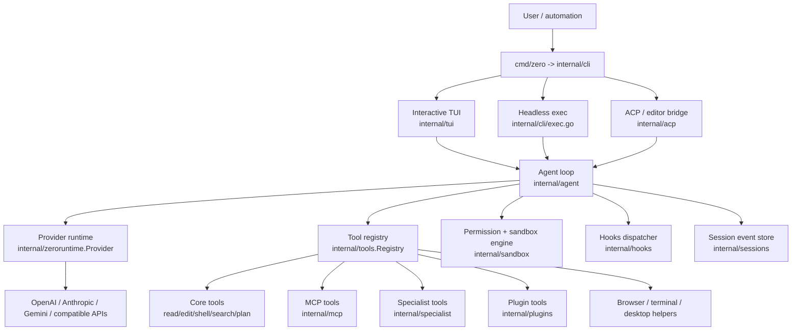

The important split is:

- `internal/tui` is the **presentation layer**. For the mechanics, see
  [Presentation Layer: Bubble Tea TUI](#presentation-layer-bubble-tea-tui) and
  [How the TUI and Agent Loop Connect](#how-the-tui-and-agent-loop-connect).
- `internal/agent` is the **reasoning/tool loop**. For the per-turn mechanics,
  see [Agent Loop](#agent-loop), [Tool Execution Lifecycle](#tool-execution-lifecycle),
  and [Context Budget and Compaction](#context-budget-and-compaction).
- `internal/tools`, `internal/sandbox`, and provider packages are the **runtime
  capability layer**. For the details, see [Runtime Provider Layer](#runtime-provider-layer),
  [Tools and Capabilities](#tools-and-capabilities), and
  [Permission and Sandbox Model](#permission-and-sandbox-model).
- `internal/sessions` is the **durable event log** used for resume, fork,
  rewind, sub-agents, and history. See [Session Storage and History](#session-storage-and-history).

## Architecture Spine

The easiest way to understand Zero is not as a set of independent packages, but
as one spine with several mechanisms attached to it:

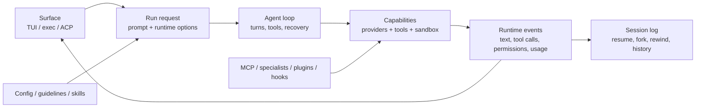

The **TUI + agent loop** is the main story because it explains the normal user
experience: type a prompt, watch the model stream, approve tool use, see file
changes, and receive a final answer. Other mechanisms are still important, but
most of them attach to the same spine:

| Mechanism | Where it attaches | What it changes |
| --- | --- | --- |
| Config, provider profiles, model registry | Before a run starts | Which provider/model is used and what defaults apply. |
| Project/user guidelines, skills, specialists context | Prompt construction | What instructions and available capabilities the model sees. |
| Tool registry, MCP, plugins, local-control helpers | Capability layer | Which actions the model may request. |
| Permission policy, sandbox, command-prefix grants | Tool execution | Whether a requested action can run, needs approval, or is denied. |
| Hooks | Tool lifecycle | Optional before/after observers or blockers around tool calls. |
| Sessions, checkpoints, compaction metadata | Event persistence/context | What can be resumed, forked, rewound, or summarized for later turns. |
| Stream-JSON | Surface layer | How the same runtime events are emitted for automation instead of rendered in the TUI. |

So this document focuses first on the TUI/agent-loop bridge, then explains the
supporting mechanisms in terms of where they connect to that bridge.

Use this as the reading path:

| If you see this concept in a high-level flow | Read this detail section |
| --- | --- |
| Surface submits a run | [Startup Flow](#startup-flow), then [How the TUI and Agent Loop Connect](#how-the-tui-and-agent-loop-connect) |
| Agent builds context and advances turns | [Agent Loop](#agent-loop) |
| “Maybe compact context” | [Context Budget and Compaction](#context-budget-and-compaction) |
| Model requests a tool | [Tool Execution Lifecycle](#tool-execution-lifecycle), then [Tools and Capabilities](#tools-and-capabilities) |
| Tool needs approval or sandbox access | [Permission and Sandbox Model](#permission-and-sandbox-model) |
| Events appear in the UI or stream-JSON | [How the TUI and Agent Loop Connect](#how-the-tui-and-agent-loop-connect), [Stream-JSON Protocol](#stream-json-protocol) |
| Resume, fork, rewind, or sub-agent history | [Session Storage and History](#session-storage-and-history) |

## Main Packages

The sections above describe the architecture in concepts. If you want to connect
those concepts to implementation details, use this table as the code map before
reading the deeper flows below.

| Package | Role |
| --- | --- |
| `cmd/zero` | Tiny binary entrypoint; calls `internal/cli.Run`. |
| `internal/cli` | Command parsing, config resolution, provider creation, registry setup, TUI/exec/ACP launch paths. |
| `internal/tui` | Bubble Tea model/update/view code, transcript rendering, composer, prompts, slash commands, setup wizard. |
| `internal/agent` | Core loop that sends messages to the model, streams output, executes tools, handles permissions, compaction, retries, and final answers. |
| `internal/zeroruntime` | Provider-neutral message, tool-call, stream, usage, and image types. Providers implement `Provider.StreamCompletion`. |
| `internal/providers` | Factory that turns a resolved provider profile into an OpenAI, Anthropic, Gemini, Codex, or compatible provider adapter. |
| `internal/tools` | Tool interface, registry, core read/write/shell/network tools, local-control wrappers, tool safety metadata, redaction, output ceilings. |
| `internal/sandbox` | Permission policy, path/network checks, grant store, command-prefix approvals, and platform sandbox backends. |
| `internal/sessions` | Local append-only session storage: `metadata.json` + `events.jsonl`. |
| `internal/config` | User/project config resolution, active provider, preferences, sandbox/tool settings. |
| `internal/mcp` | MCP server config, client runtime, permission store, and MCP tool registration. |
| `internal/specialist` / `internal/swarm` | Sub-agent manifests and team/member orchestration exposed as tools. |
| `internal/localcontrol` / `internal/browser` | Runtime helpers used by config-gated local-control tool wrappers. |
| `internal/plugins` / `internal/skills` / `internal/hooks` | Extension surfaces loaded into the agent context, tool registry, or tool lifecycle. |
| `internal/streamjson` | Machine-readable protocol for `zero exec --input-format/--output-format stream-json`. |

## Startup Flow

### Interactive TUI (`zero`)

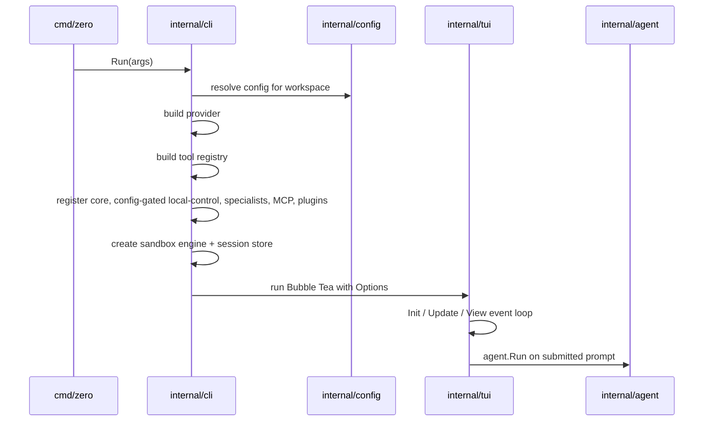

The TUI owns terminal interaction. It tracks composer state, transcript rows,
scrolling, permission dialogs, model/provider pickers, setup wizard state, and
visual updates. When the user submits a prompt, the TUI builds `agent.Options`
with callbacks like `OnText`, `OnToolCall`, `OnToolResult`, `OnPermission`,
`OnAskUser`, and `OnUsage`. Those callbacks convert runtime events into visible
transcript rows and session events.

### Headless exec (`zero exec`)

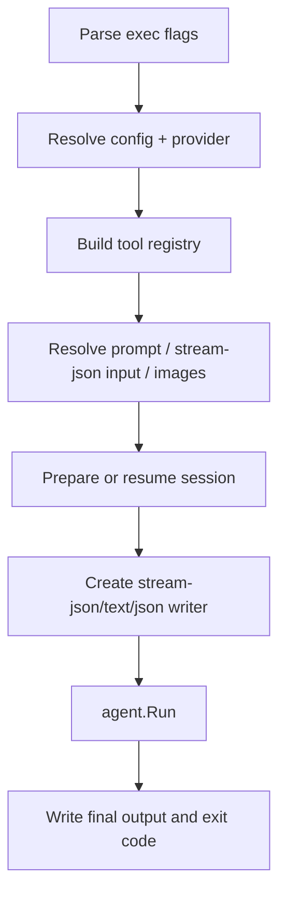

`zero exec` uses the same `agent.Run` loop as the TUI, but without interactive
terminal state. It can persist sessions, resume/fork existing sessions, run in
stream-JSON mode for automation, and always requires a stronger completion
signal so a no-tool assistant response is not treated as success while work is
still pending.

## Agent Loop

The core loop lives in `internal/agent.Run`. Conceptually, every turn follows
this cycle:

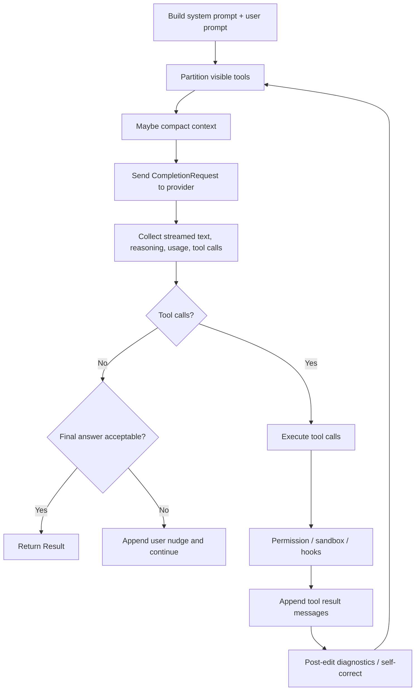

Key responsibilities of the loop:

1. **Build prompt state** — combines the system prompt, project/user guidelines,
   loaded skills/specialist instructions, the current user prompt, and images. The
   resulting message list is the model-facing context that later tool results are
   appended to. Resumed session history is replayed by the caller before a new run,
   not passed as a separate `agent.Run` history field.
2. **Expose tools** — starts from the registry built by the CLI, then filters
   tool definitions by permission mode, enabled or disabled filters, and
   deferred-loading rules. Tool schemas also count toward context budget, so they
   matter for compaction decisions.
3. **Call provider** — sends a provider-neutral `zeroruntime.CompletionRequest`.
4. **Stream events** — forwards text, reasoning, tool-call deltas, and usage to
   the caller via callbacks.
5. **Execute tools** — decodes tool arguments, checks filters, applies
   permissions and sandbox policy, dispatches hooks, runs the registered tool,
   redacts output, and appends a tool message. See
   [Tool Execution Lifecycle](#tool-execution-lifecycle).
6. **Recover and guard** — handles malformed tool calls, repeated failures,
   empty turns, context pressure, stream reconnect/retry, and max-turn fallback.
   Context pressure is handled by [Context Budget and Compaction](#context-budget-and-compaction).
7. **Finalize** — returns a final answer or a structured incomplete/stop reason.

The model never directly mutates the workspace. It asks for tool calls; Zero
validates and executes those calls through the registry, permission policy, and
sandbox engine.

## Tool Execution Lifecycle

A tool call is part of the model conversation, not a side channel that bypasses
it. The model proposes an action, Zero decides whether that action is allowed to
run, the tool returns a structured result, and that result becomes context for the
next provider request.

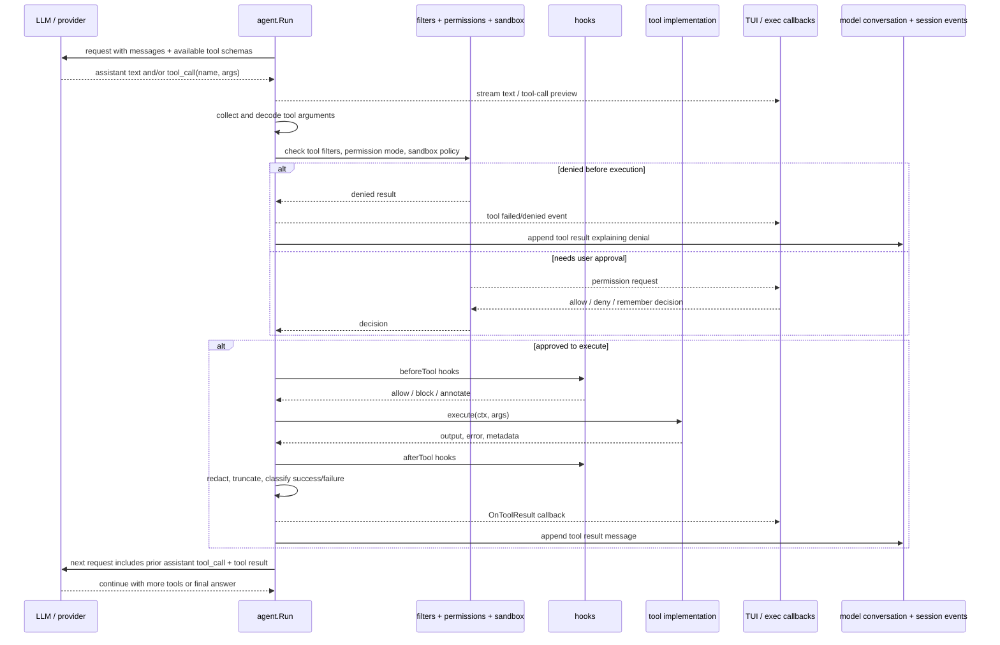

Conceptually, one requested tool goes through these phases:

1. **Proposal** — the provider streams assistant content and may emit one or more
   tool calls. Zero can show the partial tool arguments in the TUI while they are
   still streaming, but nothing has executed yet.
2. **Decode and gate** — the agent validates JSON arguments, checks whether the
   tool is enabled, applies permission mode, asks the sandbox engine about path,
   network, shell, or command-prefix constraints, and may invoke permission
   callbacks.
3. **Execute** — the selected registry entry runs locally, through MCP, as a
   specialist/sub-agent, or through a plugin/local-control helper. Hooks can run
   before or after this step.
4. **Normalize result** — Zero turns the outcome into an agent `ToolResult`: a
   success, failure, denial, cancellation, timeout, or validation error with
   output/metadata that may be redacted or truncated.
5. **Append to context** — the result is appended as a tool-result message paired
   with the assistant tool call. The next model request includes that result, so
   the model can inspect it and decide what to do next.
6. **Render and persist** — the result is surfaced to the TUI, stream-JSON
   writer, or ACP client. TUI and exec record rich tool/session events for
   resume/history; ACP currently persists conversational messages and streams
   tool/permission updates to the client.

Tool success and failure are both informative context. A successful `read_file`
result gives the model file contents; a failed `edit_file` result gives the model
an error such as “old string not found”; a denied shell command tells the model
that the action is not currently permitted. The model is expected to use that
feedback to continue, choose another tool, ask the user, or explain the blocker.

The judgement that “information is sufficient” is made by the model, not by the
TUI. Zero controls the loop mechanics: it keeps appending messages, enforces
safety, retries or nudges around malformed/empty/incomplete turns, and stops on
hard limits. But the semantic decision to call another tool versus produce a
final answer comes from the next provider response. In other words:

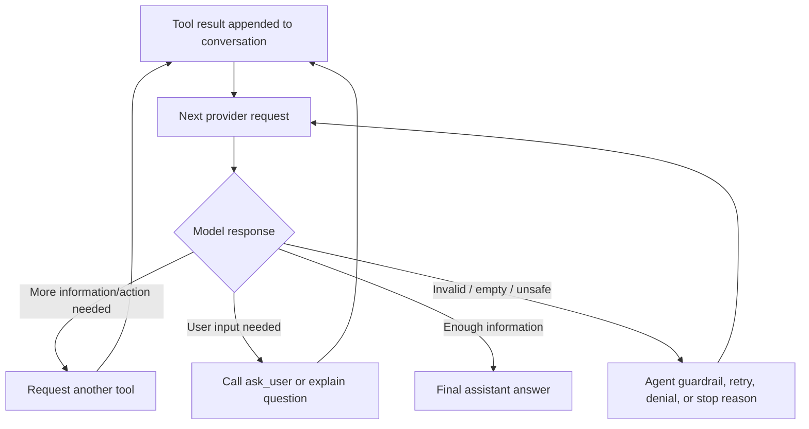

This is why tool output is usually more than UI decoration. It is part of the
working memory for the next model turn, subject to context-window pressure and
compaction. The TUI may summarize or prettify it for the user, but the agent loop
also stores the machine-facing result that the model sees.

## Context Budget and Compaction

The `Maybe compact context` step in the agent-loop diagram is Zero's context-window
pressure valve. It is not a separate memory engine; it rewrites the current
model-facing conversation so the next provider request fits within the configured
context window.

Compaction is enabled only when the run knows a positive `ContextWindow`. When it
is enabled, the loop does this near the top of each turn:

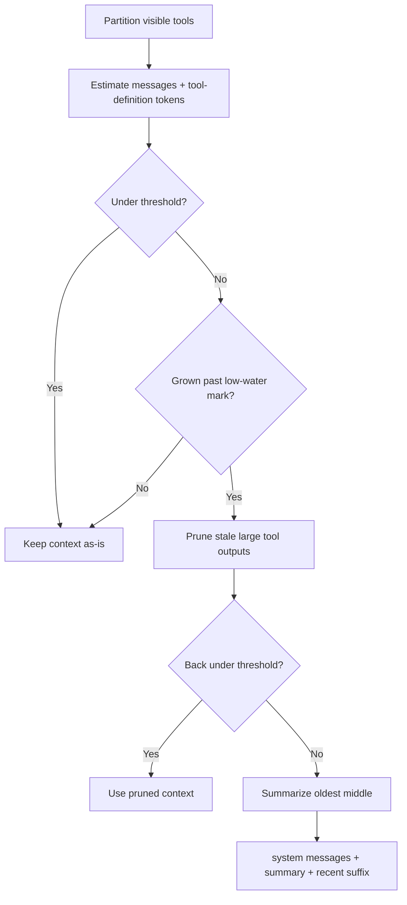

The trigger is intentionally approximate:

- Zero estimates request size using message text, images, tool-call arguments, and
  the tool definitions advertised on that turn.
- The proactive threshold is roughly **two-thirds of the context window**.
- Provider usage from completed turns is used to calibrate the rough estimate over
  time, so the budget gauge and compaction decision track the provider more
  closely after a few turns.
- A low-water mark prevents the loop from re-summarizing the same already-compacted
  history on every turn.

When compaction actually runs, it tries to preserve the parts most likely to be
needed by the model:

- leading system messages stay verbatim;
- the most recent turns stay verbatim (`CompactionPreserveLast`, defaulting to the
  agent's normal preserve count);
- the preserved suffix is widened to a provider-valid turn boundary so tool-result
  messages are not replayed without their corresponding assistant tool call;
- the older middle is summarized into one user-role message labeled
  `[Summary of earlier conversation]`;
- structured state that should not be paraphrased away, such as active plan/loaded
  skill state, is preserved alongside the prose summary.

There are two compaction paths:

1. **Proactive compaction** runs before the provider call when the estimated
   request is over threshold.
2. **Reactive compaction** runs after a provider returns a context-limit style
   error. Zero compacts once and retries that same turn; if the provider still
   rejects the request, the error is surfaced rather than looping forever.

Compaction failures are conservative. If the summarizer fails during proactive
compaction, Zero keeps the original messages and tries to continue. It does not
drop conversation history just to make room.

## Presentation Layer: Bubble Tea TUI

`internal/tui` is a Bubble Tea application. The usual Bubble Tea shape applies:

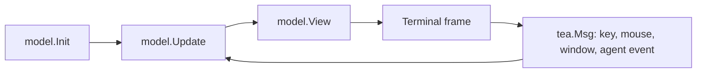

The TUI is intentionally not the agent brain. It is responsible for:

- collecting user input from the composer;
- rendering assistant text, reasoning, tool cards, permissions, plans, usage,
  files, and sidebars;
- handling slash commands and modal surfaces;
- converting agent callbacks into Bubble Tea messages;
- persisting visible session events;
- allowing live provider/model/permission changes.

When a prompt is submitted, the TUI starts a background command that invokes
`agent.Run`. Streaming callbacks send messages back into the Bubble Tea update
loop, so rendering remains responsive while the agent is working.

## How the TUI and Agent Loop Connect

A common source of confusion is that Zero has two event loops running at once:

1. **Bubble Tea loop** — owns terminal input, in-memory UI state, and frames.
2. **Agent loop** — owns model turns, tool execution, permissions, retries, and
   stop conditions.

They are connected by `tea.Cmd` and `agent.Options` callbacks. The TUI never
runs provider/tool logic directly inside `Update`; instead, submit handling gates
and dispatches a prompt, the TUI starts a background command, and that command
calls `agent.Run` with callbacks that send runtime events back to the Bubble Tea
program. Function names in this section are illustrative code anchors, not API
boundaries.

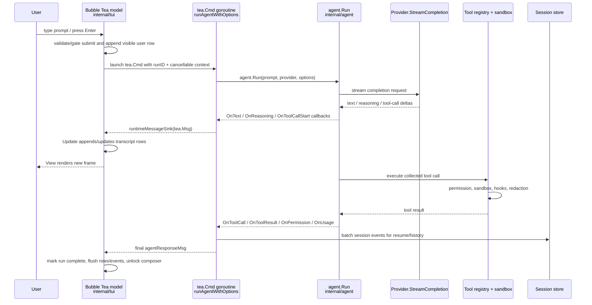

In the TUI path, the same event can have three representations:

| Runtime thing | Agent representation | TUI representation | Session representation |
| --- | --- | --- | --- |
| Assistant text | streamed provider text forwarded through `OnText` | incremental assistant row text | assistant message event |
| Reasoning preview | `OnReasoning` callback | collapsible/preview reasoning row | usually not the same as final assistant text |
| Tool call | `agent.ToolCall` from collected provider stream | tool card, specialist card, or plan panel update | `EventToolCall` |
| Tool result | `agent.ToolResult` | result card/status, changed files, plan/specialist updates | `EventToolResult` |
| Permission prompt/audit | `PermissionRequest` / `PermissionEvent` | modal prompt or permission row | permission request/decision events |
| Usage/context | provider usage + measured context | context gauge / usage metadata | usage event |

### One interactive turn, end to end

For a normal prompt in the interactive TUI:

1. Submit handling validates composer state and command gates, then dispatches
   the prompt to the launch path.
2. The launch path appends immediate UI rows, creates a cancellable run context,
   and starts `runAgent` as a `tea.Cmd`; run bookkeeping assigns the `runID` used
   to correlate later events.
3. `runAgentWithOptions` copies the current UI-controlled runtime choices into
   `agent.Options`: provider/model labels, permission mode, cwd, session ID,
   images, registry, response style, context window, and self-correction hooks.
4. The command wraps agent callbacks. For example:
   - `OnText` sends incremental assistant text into the TUI message sink.
   - `OnToolCallStart` / `OnToolCallDelta` show live tool-argument streaming.
   - `OnToolCall` creates visible tool rows and appends session events.
   - `OnToolResult` creates result rows, updates plan/specialist side panels, and
     records changed files.
   - `OnPermissionRequest` sends a prompt to the TUI and blocks the agent loop
     until the user answers or the run context is cancelled.
   - `OnAskUser` does the same for model-initiated clarification questions.
5. `agent.Run` builds provider-neutral messages and tool definitions, streams a
   provider response, executes any requested tools through the registry/sandbox,
   appends tool results back into the model conversation, and repeats until it has
   a final answer or a stop condition.
6. When `agent.Run` returns, the command emits `agentResponseMsg`. The Bubble Tea
   loop marks the run complete, flushes queued rows/session events, updates usage
   and file state, and re-enables the composer.

The important architectural point: **the TUI is stateful and reactive, but the
agent loop is the source of runtime truth for model/tool progress**. Presentation
state is derived from callback events and persisted session events; workspace
changes happen only through tools executed by the agent runtime.

### Feature flows use the same bridge

For one interactive turn, the supporting systems do not run beside the TUI/agent
loop; they run inside or around it:

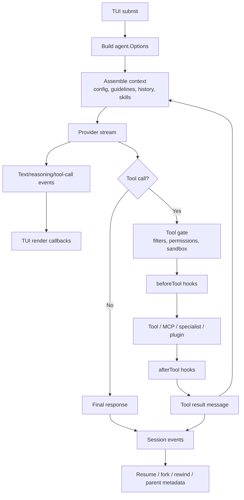

Most interactive features are variations of that same bridge rather than separate
architectures:

- **Slash commands** either mutate TUI state directly (`/model`, `/permission`,
  `/help`) or start short `tea.Cmd` jobs that later return a message to `Update`
  (`/doctor`, `/search`, `/compact`, session commands).
- **Permissions** sit between a model-requested tool call and actual execution:
  the agent blocks on `OnPermissionRequest`, the TUI surfaces a modal and sends
  the decision back through a channel, and the session log records the
  request/decision events.
- **Plans, specialists/sub-agents, and ask-user prompts** all follow the same
  runtime pattern: the model requests a capability, the agent records the
  call/result in its conversation, and the TUI mirrors the visible state as plan
  panels, specialist cards, or question forms. Specialist session metadata can
  carry parent/root and sub-agent/spec fields, with richer linkage depending on
  the specialist or swarm path.
- **Streaming tool writes** start as provider tool-call deltas before execution;
  the TUI shows the arguments live, then replaces/augments them with the actual
  `ToolResult` after the tool runs.
- **Compaction** is an agent-loop context-management step; the TUI may show that
  it happened, but the purpose is to keep the next provider request within budget.
- **Stream-JSON** is another surface over the same callbacks: `zero exec`
  serializes the events as JSON protocol events instead of Bubble Tea views.

So a feature-specific deep dive should usually explain: what user event starts it,
which `tea.Msg`/callback carries it, which agent/tool event is authoritative, and
which session events make it resumable.

## Runtime Provider Layer

Providers are hidden behind this interface in `internal/zeroruntime`:

```go
type Provider interface {
    StreamCompletion(ctx context.Context, request CompletionRequest) (<-chan StreamEvent, error)
}
```

The agent loop only knows about provider-neutral messages, tool definitions,
stream events, reasoning blocks, images, and token usage. Provider adapters in
`internal/providers/*` translate those neutral types to provider-specific APIs:

- OpenAI and OpenAI-compatible APIs;
- Anthropic and Anthropic-compatible APIs;
- Gemini;
- Codex / ChatGPT OAuth-backed runtime.

`internal/providers.New` resolves the configured model through the model
registry/catalog, normalizes API model IDs and base URLs, attaches API keys or
OAuth resolvers, and returns the concrete adapter.

## Tools and Capabilities

Tools implement a common interface and are registered by name in
`internal/tools.Registry`.

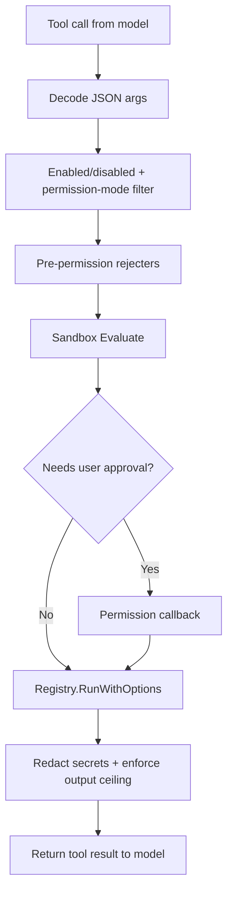

Core tool groups include:

- **Read-only tools**: file reads, directory listing, glob, grep, LSP navigation,
  skills, `ask_user`, permission requests.
- **Write tools**: `write_file`, `edit_file`, `apply_patch`, `update_plan`.
- **Shell tools**: `exec_command`, `write_stdin`, legacy `bash`.
- **Network tools**: `web_fetch` and optional web search backend.
- **Local-control tools**: config-gated wrappers for browser, terminal, desktop,
  and artifact helpers backed by packages such as `internal/localcontrol` and
  `internal/browser`.
- **Extension tools**: MCP tools, specialists/sub-agents, swarm tools, plugins.

Tool definitions include safety metadata: side-effect class, permission level,
reason, and whether prompt-gated tools are advertised in auto-like modes. The
agent uses this metadata plus per-turn filters and deferred-loading state to
choose which registered tools the model can see and whether a call can run
immediately.

## Permission and Sandbox Model

Zero has two related but separate checks:

1. **Tool permission metadata** says whether a tool is allowed, denied, or needs
   approval.
2. **Sandbox policy** evaluates the actual request: path scope, network access,
   destructive shell patterns, explicit escalation, persistent/session grants,
   and platform isolation availability.

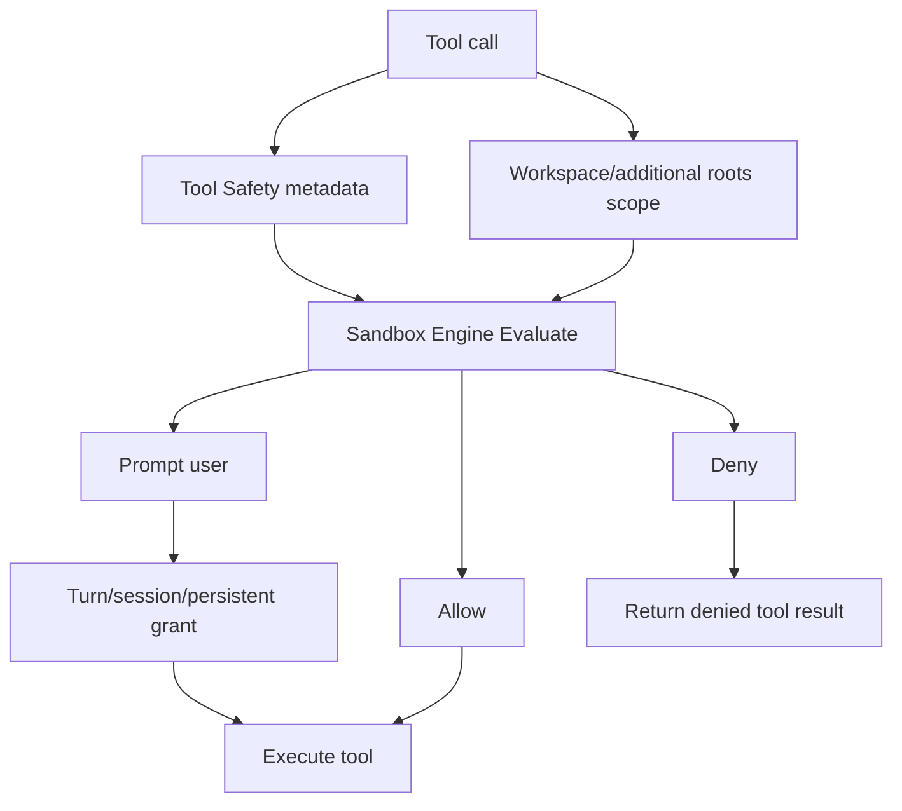

The sandbox engine can:

- auto-allow workspace writes for safe file-edit tools;
- block reads/writes outside the allowed scope;
- prompt for recoverable outside-workspace access;
- deny or prompt for network depending on policy;
- detect destructive shell commands;
- run shell commands through a platform backend when available;
- remember session or persistent grants;
- support narrow command-prefix approvals.

The user-facing TUI and `zero exec` mode both route permission requests through
callbacks, but the TUI can show interactive modals while headless mode generally
returns non-interactive fallback behavior unless a protocol/client handles it.

## Session Storage and History

Sessions live locally under Zero's data directory. A session directory contains:

- `metadata.json` — session ID, title, cwd, provider/model, parent/root IDs,
  spec/sub-agent fields, timestamps, and event count.
- `events.jsonl` — append-only event log with messages, tool calls/results,
  permissions, usage, checkpoints, forks, compaction, and specs. TUI and exec use
  the richer event stream; ACP currently records conversational message history
  while streaming tool and permission updates to the client.

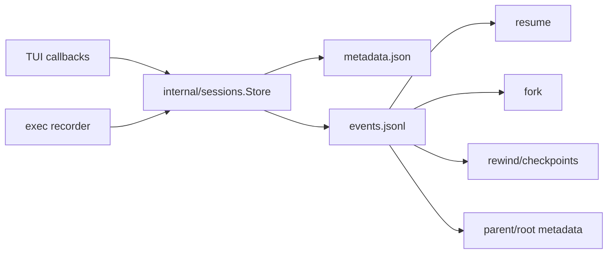

This is why sessions can be resumed, forked, rewound, and inspected without a
remote service. Zero stores the local event history; providers only receive the
messages needed for the current completion request.

## Stream-JSON Protocol

`zero exec --output-format stream-json` emits newline-delimited JSON events for
integrations and CI. The protocol is implemented in `internal/streamjson` and is
specified in [STREAM_JSON_PROTOCOL.md](STREAM_JSON_PROTOCOL.md).

Common output event types include:

- `run_start`, `text`, `reasoning`, `tool_call`, `tool_result`;
- `permission`, `permission_request`, `permission_decision`;
- `checkpoint`, `restore`, `usage`, `final`, `warning`, `error`, `run_end`.

Input stream-JSON can provide `prompt` or `message` events and image payloads.
The CLI parses those events, resolves a single prompt, validates/decodes images,
and passes the result into the same agent loop used everywhere else.

## Extensibility Flow

Zero's extension surfaces are loaded before the agent loop starts:

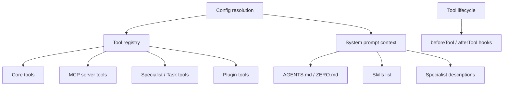

- **Project/user guidelines** become prompt context.
- **Skills** are instruction packs the model can load on demand.
- **Specialists** are sub-agents callable through the `Task` tool.
- **MCP servers** contribute external tools.
- **Plugins** can add tools, hooks, and skill roots. Bootstrap always registers a
  multi-root skill tool: primary Zero skills dir, optional `~/.agents/skills`,
  then plugin skill roots (earlier wins). `internal/skills` owns that merge via
  `LoadFromRoots` / `DiscoveryRoots`; single-root `Load` remains for install/write.
- **Hooks** can observe or block tool lifecycle events.

## End-to-End Data Flow

A typical interactive edit request looks like this:

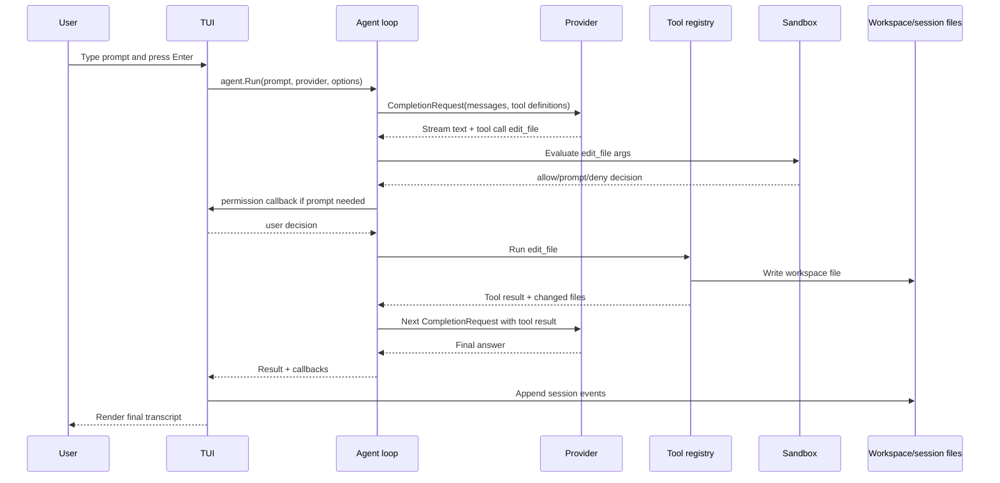

The same request in `zero exec` follows the same provider/tool/sandbox path, but
streaming events are written to stdout/stderr instead of rendered in Bubble Tea.

## Mental Model

When you work on Zero, start by locating the change on the four-layer spine from
[Architecture Spine](#architecture-spine) — Surface, Agent loop, Capabilities,
Persistence — then jump to the package that owns that boundary:

- UI behavior? Start in `internal/tui`.
- Command-line behavior? Start in `internal/cli`.
- Model/tool-turn behavior? Start in `internal/agent`.
- A new capability? Register a tool in `internal/tools` or an extension surface.
- Safety policy? Start in `internal/sandbox` and agent permission wiring.
- Resume/history behavior? Start in `internal/sessions` and session recorders.
